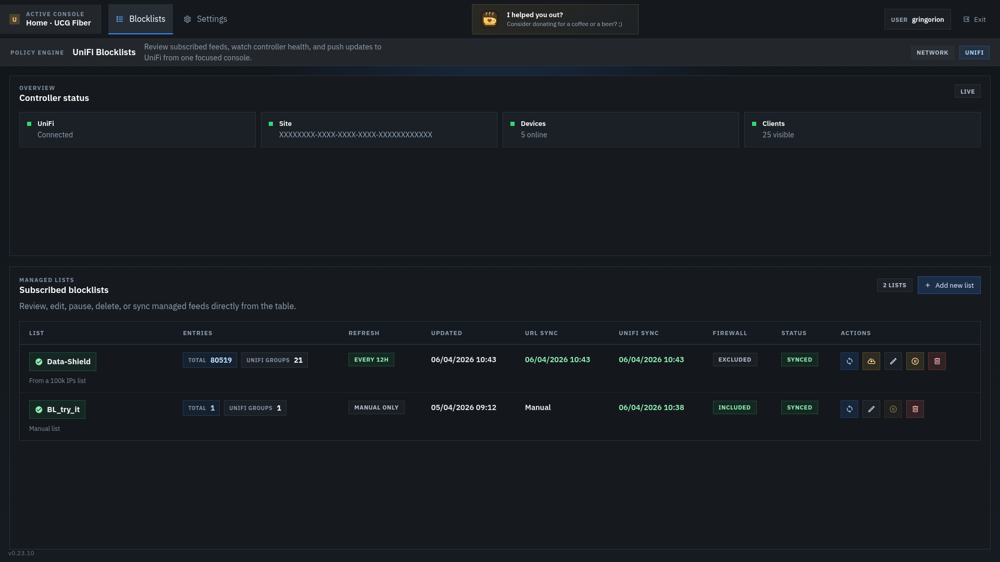

# UniFi Blocklists

UniFi Blocklists est une interface web pour centraliser des listes CIDR IPv4,
les synchroniser vers UniFi et choisir celles qui alimentent la policy firewall
geree par l'application.



## Ce que vous pouvez faire

- creer et modifier vos blocklists dans une seule interface
- importer automatiquement des CIDR depuis des URL distantes
- synchroniser les listes vers des groupes UniFi geres par l'application
- choisir, liste par liste, si elle doit aussi alimenter la policy firewall
- suivre l'etat de la derniere synchronisation et les erreurs eventuelles
- proteger l'interface avec un identifiant et un mot de passe locaux

## Installation Docker

1. Copiez le fichier d'exemple:

```bash
cp .env.example .env
```

2. Renseignez votre URL UniFi locale, votre cle API et votre site.
3. Lancez l'application:

```bash
docker compose up -d
```

4. Ouvrez `http://<host>:8080`.

## Demarrage avec docker run

```bash
docker run -d \
  --name unifi-bl \
  --restart unless-stopped \
  -p 8080:8080 \
  -v "$(pwd)/data:/app/data" \
  --env-file .env \
  gringorion/unifi-bl:latest
```

## Exemple docker-compose

Copiez-collez ce fichier `docker-compose.yml`:

```yaml
services:
  app:
    image: gringorion/unifi-bl:latest
    container_name: unifi-bl
    restart: unless-stopped
    ports:
      - "8080:8080"
    env_file:
      - .env
    volumes:
      - ./data:/app/data
```

## Reglages utiles

- `UNIFI_NETWORK_BASE_URL`: URL locale UniFi Network
- `UNIFI_NETWORK_API_KEY`: cle API locale UniFi
- `UNIFI_SITE_ID`: site cible
- `UNIFI_BLOCKLISTS_MAX_ENTRIES`: taille maximale d'un groupe UniFi
- `UNIFI_FIREWALL_POLICY_NAME`: nom de la policy geree
- `APP_AUTH_USERNAME`, `APP_AUTH_PASSWORD`, `APP_AUTH_PASSWORD_SEED`: active la connexion locale

## Dans l'interface

- chaque blocklist peut etre activee ou non pour la synchronisation
- chaque blocklist peut etre incluse ou non dans la policy firewall
- la policy geree porte par defaut le nom `unifi-bl - block enabled lists`
- les plages IPv4 privees ou locales ne sont pas ajoutees a la policy geree

## A savoir

- IPv4 CIDR uniquement
- les donnees locales sont conservees dans le dossier `data/`
- l'application fonctionne tres bien avec `docker compose up -d`
